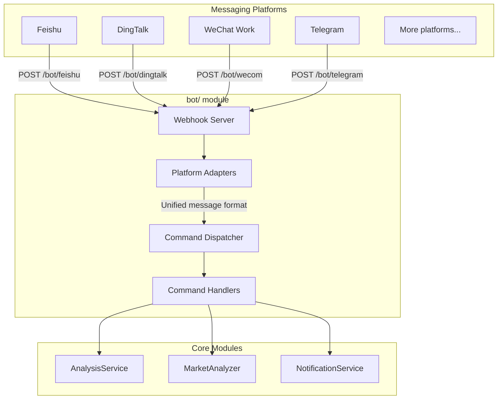

# Bot 연동 가이드

이 문서는 bot 모듈 아키텍처, 지원 명령어, 웹훅 라우트, 플랫폼 연동 설정 방법을 설명합니다.

> **용어:** 여기서 "엔터프라이즈 bot"은 메시징 플랫폼(Feishu / DingTalk / WeChat Work / Telegram)에서 웹훅으로 명령을 받고, 분석 파이프라인을 호출해 대화 안에서 답변하는 챗봇을 뜻합니다.

---

## 1. 아키텍처 개요



---

## 2. 디렉터리 구조

```
bot/
├── __init__.py             # 모듈 진입점, 주요 클래스 export
├── models.py               # 통합 메시지/응답 모델
├── dispatcher.py           # 명령 디스패처(핵심)
├── handler.py              # 웹훅 핸들러 함수(플랫폼별)
├── commands/               # 명령 핸들러
│   ├── __init__.py
│   ├── base.py             # 명령 추상 base class
│   ├── analyze.py          # /analyze — 종목 분석
│   ├── ask.py              # /ask — 단일 턴 질문
│   ├── batch.py            # /batch — 관심 종목 일괄 분석
│   ├── chat.py             # /chat — 멀티턴 전략 채팅
│   ├── market.py           # /market — 시장 리뷰
│   ├── help.py             # /help — 도움말
│   └── status.py           # /status — 시스템 상태
└── platforms/              # 플랫폼 어댑터
    ├── __init__.py
    ├── base.py             # 플랫폼 추상 base class
    ├── dingtalk.py         # DingTalk bot
    ├── dingtalk_stream.py  # DingTalk Stream bot
    └── feishu_stream.py    # Feishu (Lark) Stream bot
```

---

## 3. 핵심 추상화

### 3.1 통합 메시지 모델(`bot/models.py`)

```python
@dataclass
class BotMessage:
    platform: str       # 플랫폼 ID: feishu / dingtalk / wecom / telegram
    user_id: str        # 발신자 ID
    user_name: str      # 발신자 표시 이름
    chat_id: str        # 대화 ID(그룹 또는 DM)
    chat_type: str      # 대화 유형: group / private
    content: str        # 메시지 텍스트
    raw_data: Dict      # 원본 요청 데이터(플랫폼별)
    timestamp: datetime
    mentioned: bool = False  # bot이 @멘션되었는지 여부

@dataclass
class BotResponse:
    text: str
    markdown: bool = False  # 응답이 Markdown인지 여부
    at_user: bool = True    # 발신자를 @멘션할지 여부
```

### 3.2 플랫폼 어댑터 Base(`bot/platforms/base.py`)

```python
class BotPlatform(ABC):
    @property
    @abstractmethod
    def platform_name(self) -> str: ...

    @abstractmethod
    def verify_request(self, headers: Dict, body: bytes) -> bool:
        """요청 서명 검증(보안 검사)"""
        ...

    @abstractmethod
    def parse_message(self, data: Dict) -> Optional[BotMessage]:
        """플랫폼 메시지를 통합 형식으로 파싱"""
        ...

    @abstractmethod
    def format_response(self, response: BotResponse, message: BotMessage) -> WebhookResponse:
        """통합 응답을 플랫폼 형식으로 변환"""
        ...
```

### 3.3 명령 Base Class(`bot/commands/base.py`)

```python
class BotCommand(ABC):
    @property
    @abstractmethod
    def name(self) -> str: ...          # 예: 'analyze'

    @property
    @abstractmethod
    def aliases(self) -> List[str]: ... # 예: ['a', 'analyse']

    @property
    @abstractmethod
    def description(self) -> str: ...

    @property
    @abstractmethod
    def usage(self) -> str: ...

    @abstractmethod
    def execute(self, message: BotMessage, args: List[str]) -> BotResponse: ...
```

---

## 4. 지원 명령어

| 명령어 | 설명 | 예시 |
|---------|-------------|---------|
| `/analyze` | 특정 종목 분석 | `/analyze AAPL` 또는 `/analyze 600519` |
| `/ask` | 종목 또는 시장에 대한 단일 턴 질문 | `/ask what is RSI for AAPL` |
| `/batch` | 설정된 관심 종목을 일괄 분석 | `/batch` |
| `/chat` | 멀티턴 전략 채팅(대화 컨텍스트 유지) | `/chat` |
| `/market` | 시장 리뷰(A주 / 미국 주식) | `/market` |
| `/help` | 도움말 표시 | `/help` |
| `/status` | 시스템 상태 표시 | `/status` |

> **종목 코드 형식:** A주는 6자리 코드(예: `600519`), 홍콩 주식은 `hk` 접두사(예: `hk00700`), 미국 주식은 ticker symbol(예: `AAPL`, `TSLA`)을 사용합니다.

---

## 5. `/status`와 LLM 설정 진단

### `/status` 준비 상태의 설정 우선순위

- `/status`가 표시하는 AI 사용 가능 여부는 런타임 우선순위를 따릅니다.
  - `LITELLM_CONFIG`(LiteLLM YAML)
  - `LLM_CHANNELS`
  - legacy 공급자 키(`GEMINI_API_KEY` / `OPENAI_API_KEY` / `ANTHROPIC_API_KEY` / `DEEPSEEK_API_KEY`)
- 기본 모델(`LITELLM_MODEL` 또는 `AGENT_LITELLM_MODEL`)에 활성 레이어에서 설정된 소스가 없으면 `/status`는 `AI 服务未配置`를 표시하고 명시적인 이유 줄을 유지합니다.
- 이 저장소의 런타임 의존성 제약은 `litellm>=1.80.10,!=1.82.7,!=1.82.8,<2.0.0`이며, 현재 status 의미는 이 제약에 맞춰져 있습니다.
- 이 진단은 LLM 검사에서 `GET /api/v1/system/config/setup/status`와 같은 준비 상태 규칙을 따릅니다. channels/yaml은 legacy 키보다 높은 우선순위로 활성화되며, 모드를 전환할 때 조용한 마이그레이션은 수행하지 않습니다.

### Fallback 및 마이그레이션 경계

- `LITELLM_CONFIG` 또는 `LLM_CHANNELS`가 활성화되면, 낮은 우선순위의 legacy 공급자 키는 해당 실행의 활성 소스로 사용되지 않습니다(조용한 downgrade 없음).
- 이 변경은 진단만 개선하며 자동 마이그레이션을 수행하지 않습니다. legacy 설정값은 시작 또는 status 수집 중 삭제되거나 다시 작성되지 않습니다.

### 공식 호환성 참고 자료(트리아지용)

- LiteLLM docs: https://docs.litellm.ai/
- LiteLLM OpenAI-compatible provider: https://docs.litellm.ai/docs/providers/openai_compatible
- OpenAI Chat API: https://platform.openai.com/docs/api-reference/chat
- DeepSeek API docs: https://api-docs.deepseek.com/
- Kimi Moonshot compatibility: https://platform.moonshot.ai/docs/guide/compatibility
- Gemini OpenAI compatibility: https://ai.google.dev/gemini-api/docs/openai
- Ollama API docs: https://github.com/ollama/ollama/blob/main/docs/api.md

## 6. 웹훅 라우트

각 플랫폼의 핸들러 함수는 `bot/handler.py`에 있습니다.
이 라우트들은 **아직 FastAPI 애플리케이션에 연결되어 있지 않으므로**, 직접 mount해야 합니다.

| 라우트 | 메서드 | 상태 | 참고 |
|-------|--------|--------|-------|
| `/bot/dingtalk` | POST | **Ready** | `DingtalkPlatform`이 `ALL_PLATFORMS`에 등록되어 있음 |
| `/bot/feishu` | POST | Stream only | `feishu_stream.py` 사용. `ALL_PLATFORMS`에 Webhook 어댑터 없음 |
| `/bot/wecom` | POST | Not implemented | 핸들러는 있지만 플랫폼 어댑터 없음 |
| `/bot/telegram` | POST | Not implemented | 핸들러는 있지만 플랫폼 어댑터 없음 |

FastAPI 앱에 DingTalk 웹훅을 mount하는 예시:

```python
from bot.handler import handle_dingtalk_webhook

@app.post("/bot/dingtalk")
async def dingtalk_webhook(request: Request):
    headers = dict(request.headers)
    body = await request.body()
    return handle_dingtalk_webhook(headers, body)
```

---

## 7. 설정

다음 내용을 `.env`에 추가하세요. 이 중 일부 bot 전용 키(예: DingTalk 및 Feishu 앱 자격 증명)는 이미 `.env.example`에 나와 있지만, 그렇지 않은 키도 있으므로 이 섹션을 bot 설정용 통합 레퍼런스로 보세요.

```dotenv
# --- Bot general ---
BOT_ENABLED=false
BOT_COMMAND_PREFIX=/

# --- Feishu (Lark) bot ---
FEISHU_APP_ID=
FEISHU_APP_SECRET=
FEISHU_VERIFICATION_TOKEN=    # 이벤트 검증 토큰
FEISHU_ENCRYPT_KEY=           # 암호화 키(선택)

# --- DingTalk bot ---
DINGTALK_APP_KEY=
DINGTALK_APP_SECRET=

# --- WeChat Work bot (in development) ---
WECOM_TOKEN=
WECOM_ENCODING_AES_KEY=

# --- Telegram bot ---
TELEGRAM_BOT_TOKEN=           # @BotFather에서 받기
TELEGRAM_WEBHOOK_SECRET=      # 웹훅 secret token
```

---

## 7. Bot 확장

### 새 플랫폼 어댑터 추가

1. `bot/platforms/`에 새 파일을 만듭니다.
2. `BotPlatform`을 상속하고 `verify_request`, `parse_message`, `format_response`를 구현합니다.
3. 콜백 경로가 `/api/v1/bot/<platform>`이 아니라 `/bot/<platform>`로 유지되도록, `api/v1/router.py` 대신 FastAPI 앱(예: `api/app.py`)에 웹훅 라우트를 직접 mount합니다.

### 새 명령어 추가

1. `bot/commands/`에 새 파일을 만듭니다.
2. `BotCommand`를 상속하고 `execute` 메서드를 구현합니다.
3. 디스패처 시작 코드에 명령을 등록합니다.
